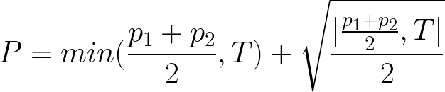

# 1st Year Projects

## 1st Semester
- **IAC (Mid Submission):** 4.80/5.00 *(18.80/20.00)*
- **IAC (Final Submission):** 11.50/16.00 *(14.375/20.00)*
- **IAC (Final):** 16.30/20.00
------------
- **FP (1st Project):** 18.95/20.00
- **FP (2nd Project):** 19.50/20.00

## 2nd Semester
- **IAED (1st Project):** 19.50/20.00
- **IAED (2nd Project):** 19.80/20.00

*(These grades do not take in account the practic test). For the curious:*

- **Practic Test:** 20.00/20.00
- **Practic Grade Overall:** 20.00/20.00 __*__

------------
- **LP (Project):** 20.00/20.00

__*__*it actually did bump above 20 (roughly 20.07) due to the weird global score formula:*

- *Where P is the practic component grade*
- *p1 and p2 are the projects 1 and 2 respectively*
- *T is the practical test*